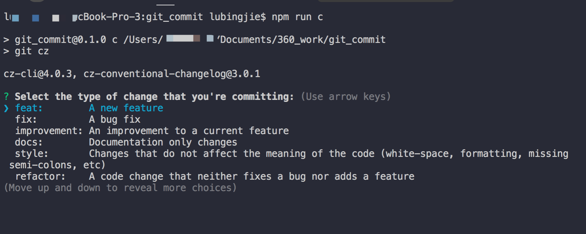

# 项目中Git message格式

## 类型选择

- feat： 新增feature
- fix: 修复bug
- docs: 仅仅修改了文档，比如README, CHANGELOG, CONTRIBUTE等等
- style: 仅仅修改了空格、格式缩进、都好等等，不改变代码逻辑
- refactor: 代码重构，没有加新功能或者修复bug
- perf: 优化相关，比如提升性能、体验
- test: 测试用例，包括单元测试、集成测试等
- chore: 改变构建流程、或者增加依赖库、工具等
- revert: 回滚到上一个版本

## 工具

可以使用典型的git工作流程或通过使用CLI向导[Commitizen](https://github.com/commitizen/cz-cli)来添加提交消息格式。

- commitizen
- cz-conventional-changelog
- commitlint
- husky

### commitizen && cz-conventional-changelog

我们使用 `commitizen` 和 `cz-lerna-changelog` 来规范提交，为后面自动生成日志作好准备.

所需要的依赖包：

```shell
# 安装 commitizen
npm i -D commitizen
# 日志管理
npm i -D cz-conventional-changelog
```

安装完成后， 在`package.json`中增加`config`字段，把`cz-conventional-changelog`配置给`commitizen`。同时因为`commitizen`不是全局安全的，所以需要添加 `scripts` 脚本来执行 `git-cz`

```json
{
  "name": "root",
  "private": true,
  "scripts": {
    "c": "git-cz"
  },
  "config": {
    "commitizen": {
      "path": "./node_modules/cz-conventional-changelog"
    }
  },
  "devDependencies": {
    "commitizen": "^4.0.3",
    "cz-conventional-changelog": "^3.1.0"
  }
}
```

之后在常规的开发中就可以使用 `npm run c` 来根据提示一步一步输入，来完成代码的提交。



#### 生成CHANGELOG

- conventional-changelog -p angular -i CHANGELOG.md -s (该命令不会覆盖以前的 Change log，只会 在CHANGELOG.md的头部加上自从上次发布以来的变动)

- conventional-changelog -p angular -i CHANGELOG.md -s -r 0 (生成所有发布的 Change log

- 或者方便使用直接写入package.json的scripts字段:

  ```json
  {
    "scripts": {
          "changelog": "conventional-changelog -p angular -i CHANGELOG.md -s -r 0"
        }
  }
  ```

  让后直接运行`npm run changelog`

### commitlint && husky

上面使用的`commitizen`来规范提交，但是需要开发者自觉使用`npm run c`，万一忘记使用了，直接使用了`git commit`提交怎么办呢？此时我们就需要对提交的信息进行校验，如果不合法就不让提交; 校验的工作由 `commitlint` 来完成，校验的时机则由 `husky`来指定。`husky` 继承了 `Git` 下所有的钩子，在触发钩子的时候，`husky` 可以阻止不合法的 `commit`,`push` 等等。

```shell
# 安装 commitlint 以及要遵守的规范
npm i -D @commitlint/cli @commitlint/config-conventional
```

在根目录下创建`commitlint.config.js`指定`commitlint`的相关规范。

```javascript
module.exports = {
  extends: ['@commitlint/config-conventional']
}
```

安装husky

```shell
npm i -D husky
```

在`package.json`中增加配置

```json
"husky": {
    "hooks": {
      "commit-msg": "commitlint -E HUSKY_GIT_PARAMS"
    }
  }
```

`commit-msg`是git提交时校验提交信息的钩子，当触发时便会使用 `commitlit` 来校验。安装配置完成后，想通过 `git commit` 或者其它第三方工具提交时，只要提交信息不符合规范就无法提交。
